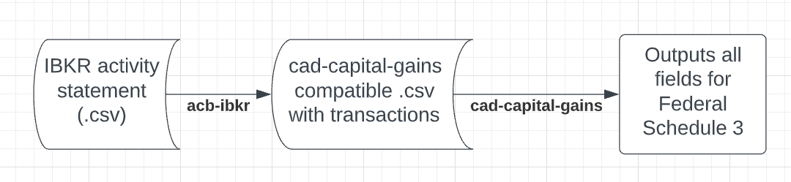

# acb-ibkr

Parses annual activity statement in `.csv` from IBKR, automatically calculates correct ACB for Schedule 3.

For use with this [cad-capital-gains](https://github.com/Bizzaro/cad-capital-gains) fork (installed from GitHub via `requirements.txt`, including **GBP** support).


## Why?
T5008 is inaccurate even using a single broker. Fractional shares are not included in calculations, exchange rates are also not BoC rates. This is common knowledge amongst CPAs and also the CRA itself.

## New tax season and need a refresher?
1. Download a new csv from client portal. 
```
Performance & Reports > Statements > Activity > Period: Annual > Download the CSV
```
2. Place it in `./source`
3. Set the tax year (default `2025` in `launch.sh`, or `YEAR=2022 ./launch.sh`) and run `./launch.sh`.
4. Look for a new file called `schedule3-XXXX.csv` to import
> Options trades are excluded from this `csv` and need to be entered manually.

## How to use
1. Sign in to client portal, then go: 
```
Performance & Reports > Statements > Activity > Period: Annual > Download the CSV
```

1. Create virtual env 
```
python3 -m venv virtual-env 
source virtual-env/bin/activate
```

2. Install dependencies, including **cad-capital-gains** from the GitHub fork (`requirements.txt` tracks `@master`). Optionally pin a git commit in that file for reproducible installs.

```
pip3 install -r requirements.txt
```

After you push **new commits** to the fork, pip often **does not** upgrade `cad-capital-gains` (same version in `pyproject.toml` → requirement already “satisfied”). Pull the latest from `master` with:

```
./refresh-capgains.sh
```

(Or: `pip install --upgrade --no-cache-dir --force-reinstall "cad-capgains @ git+https://github.com/Bizzaro/cad-capital-gains.git@master"`.)

3. Drop all your `.csv`'s from every year into the `./source` folder.

4. Generate a compatible `cad-capital-gains` compatible `.csv`
```
python3 ibkr.py
```

5. Run the `capgains` CLI
```
capgains calc master.csv 2022
```

Or `./launch.sh` (default year `2025`, or e.g. `YEAR=2022 ./launch.sh`).

### DISCLAIMER
YOU (THE USER OF THIS SCRIPT) ARE RESPONSIBLE FOR THE NUMBERS PRODUCED BY THIS TOOL. IT HAS NOT BEEN AUDITED OR VERIFIED BY A THIRD PARTY. THIS IS NOT TAX ADVICE OR CERTIFIED TAX SOFTWARE. DOING RANDOM SPOT CHECKS OF CALCULATIONS IS RECOMMENDED. CONSULT A CPA FOR ALL YOUR TAX INQUIRIES.