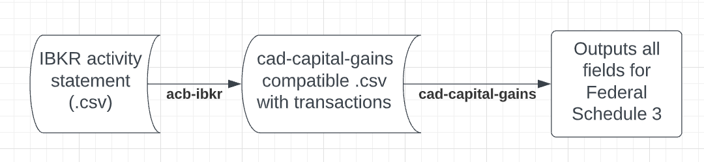

# acb-ibkr

Parses annual activity statement in `.csv` from IBKR, automatically calculates correct ACB for Schedule 3.

For use with https://github.com/Bizzaro/cad-capital-gains.


## Why?
T5008 is inaccurate even using a single broker. Fractional shares are not included in calculations, exchange rates are also not BoC rates. This is common knowledge amongst CPAs and also the CRA itself.

## New tax season and need a refresher?
1. Download a new csv from client portal. 
`Reports > Statements > Activity > Period: Annual > Format: CSV > Run`
2. Place it in `./source`
3. Update the year in `launch.sh` and run it!
4. Look for a new file called `schedule3-XXXX.csv` to import
5. Options trades are excluded from this `csv` and need to be entered manually.

## How to use
1. Sign in to client portal, then go: 
```
Reports > Statements > Activity > Period: Annual > Format: CSV > Run
```

1. Create virtual env 
```
python3 -m venv virtual-env 
source virtual-env/bin/activate
```

2. This installs my [cad-capital-gain](https://github.com/Bizzaro/cad-capital-gains) fork
```
pip3 install -r requirements.txt
```

3. Drop all your `.csv`'s from every year into the `./source` folder.

4. Generate a compatible `cad-capital-gains` compatible `.csv`
```
python3 ibkr.py
```

5. Run the `capgains` (cad-capital-gains) tool
```
capgains calc master.csv 2022
```

### DISCLAIMER
YOU (THE USER OF THIS SCRIPT) ARE RESPONSIBLE FOR THE NUMBERS PRODUCED BY THIS TOOL. IT HAS NOT BEEN AUDITED OR VERIFIED BY A THIRD PARTY. THIS IS NOT TAX ADVICE OR CERTIFIED TAX SOFTWARE. DOING RANDOM SPOT CHECKS OF CALCULATIONS IS RECOMMENDED. CONSULT A CPA FOR ALL YOUR TAX INQUIRIES.
